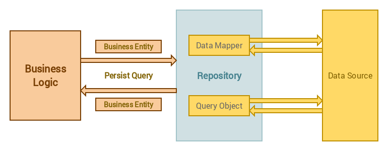

# Laravel Repository Design Pattern

[](https://packagist.org/packages/pp-spaces/laravel-repository)
[](https://packagist.org/packages/pp-spaces/laravel-repository)
[](https://travis-ci.org/pp-spaces/laravel-repository)
[](https://packagist.org/packages/pp-spaces/laravel-repository)

## Contents

- [What is the Repository Design Pattern?](#what-is-the-repository-design-pattern)
- [Usage](#usage)
  - [Installation](#installation)
  - [Make a repository](#make-a-repository)
  - [Use Case](#use-case)
  - [Help](#help)

## Upgrade Notice

> NOTE: The reason why I modified how the `Repository` is being created because I want the `Repository` to use `Route Model Binding` for faster data query.

- [How to upgrade?](#how-to-upgrade)

## What is the Repository Design Pattern



To put it simply, it is an implementation of a brokering layer between the application and a data source. Neither party needs to be be aware of the other to perform their respective jobs which allows us to have a decoupled architecture which in turn helps in the scaling of the application in the big leagues without having hard dependencies.

## Is it the magic bullet

Well, no it is not. Like every design pattern it has its ups and downs, pros and cons.

### Pros:

- Separation of concerns; the application need not know about or track any or all data sources.
- Allows easy unit testing as the repositories are bound to interfaces which are injected into classes at run time.
- DRY (Dont Repeat Yourself) design, the code to query and fetch data from data source(s) is not repeated.

### Cons:

- Adds another layer of abstraction which adds a certain level of complexity making it an overkill for small applications.

## Source

- [Repository Design Pattern Demystified](https://www.sitepoint.com/repository-design-pattern-demystified/)
- [Use the Repository Design pattern in a Laravel application](https://medium.com/employbl/use-the-repository-design-pattern-in-a-laravel-application-13f0b46a3dce)

# Usage

This package provide a command-line interface for you to create repository in your **Laravel** application.

## Installation

Require `pp-spaces/laravel-repository` package to your laravel installation

```sh
composer require pp-spaces/laravel-repository
```

## Make a repository

Run the following command to generate repository:

```sh
php artisan make:repository UserRepository
```

To make model repository simply run:

```sh
php artisan make:repository UserRepository --model=User
```

## Use Case

```
   +-------------+                                +-------------+       +-------------+
   |             |                                |             |       |             |
   |             |---------------------------------             ---------             |
   |             |      +-------------------+     |             |       |             |
   | Controllers |      |      Persist      |     | Repository  |       |   Models    |
   |             |      |   Database Query  |     |             |       |             |
   |             |      +-------------------+     |             |       |             |
   |             ---------------------------------|             ---------             |
   |             |                                |             |       |             |
   +-------------+                                +-------------+       +-------------+
```

### How to use Repository

Create your repository, e.g. `UserRepository` for `User` model:

```sh
php artisan make:repository UserRepository --model=User
```

Update `UserRepository` logic:

```php
namespace App\Http\Repositories;

use PPSpaces\Repositories\Repository;

class UserRepository extends Repository {

    /**
     * The user model instance.
     *
     * @var \App\User
     */
    protected $model = "App\User";

    /**
     * Scope a query for the model before executing
     *
     * @param \Illuminate\Database\Query\Builder $query
     * @return void
     */
    public function before($query) {
        $query->role('staff');
    }

    /**
     * Get all of the models from the database.
     *
     * @param  array|mixed  $columns
     * @return \Illuminate\Database\Eloquent\Collection|static[]
     */
    public function get($columns = ['*']) {
        $users = $this->repository
                    ->active()
                    ->orderBy('updated_at', 'DESC')
                    ->get();

        return $users;
    }
}
```

> NOTE: Check `PPSpaces\Repositories\Model` for available methods that you may override. Keep in mind that you still have access to all Model instance that you've created. The `$this->user` is the instance of your `\App\User` model.

Within your `UserController` assume you have a resource controller created. Inject the `UserRepository` to the contoller. Now you can access the repository in your controller method:

```php
use App\Http\Repositories\UserRepository;

class UserController extends Controller
{
    protected $users;

    public function __construct(UserRepository $users)
    {
        $this->users = $users;
    }

    public function index()
    {
        return $this->users->get();
    }
}
```

Or alternatively, you may use **Route Model Binding** on the controller actions whose `type-hinted` variable names match a route segment name.

> Read more about [Route Model Binding](https://laravel.com/docs/master/routing#route-model-binding) here

```php
public function index(UserRepository $user)
{
    return $user->get();
}

public function show(UserRepository $user)
{
    // Authorizing the repository model
    // Check https://laravel.com/docs/master/authorization
    $this->authorize('view', $user->model());

    // This $user will resolved by the id provided by the router
    // e.g. /api/user/1
    // $user will be the result of $user->id === 1
    return $user;
}
```

## How to upgrade?

> Upgrade from `v0.0.9` or earilier to `v1.0.0`

### What you need to do

```diff
namespace App\Http\Repositories;

- use App\User;

- use PPSpaces\Repositories\Model as Repository;
+ use PPSpaces\Repositories\Repository;

class UserRepository extends Repository {

+    /**
+     * The user model instance.
+     *
+     * @var \App\User
+     */
+    protected $model = "App\User";

-     protected $user;

-    public function __construct(User $user) {
-        $this->user = $user;
-    }

    public function index()
    {
         // `$this->users->all()` will always resolved the same result as `$this->users->get()`
-        return $this->users->all();
+        return $this->users->get();
    }

}
```

## Help

```
Description:
  Create a new repository class

Usage:
  make:repository [options] [--] <name>

Arguments:
  name                  The name of the class

Options:
  -m, --model[=MODEL]   Generate a repository for the given model.
  -h, --help            Display this help message
  -q, --quiet           Do not output any message
  -V, --version         Display this application version
      --ansi            Force ANSI output
      --no-ansi         Disable ANSI output
  -n, --no-interaction  Do not ask any interactive question
      --env[=ENV]       The environment the command should run under
  -v|vv|vvv, --verbose  Increase the verbosity of messages: 1 for normal output, 2 for more verbose output and 3 for debug
```
